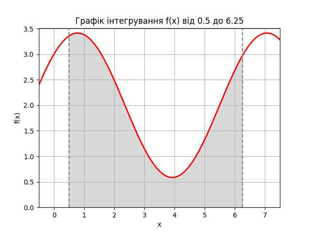

# goit-algo-hw-10

## setup

```
pip install matplotlib
pip install scipy

```

## task01

```
Status: Optimal
Виробляти лимонаду: 30.0
Виробляти фруктового соку: 20.0
Загальна кількість продуктів: 50.0
```

## task02

### Функція

```
np.sin(x) + np.cos(x) + 2
```

### Графік функції



### Результат роботи

```
Інтеграл:  10.865528388514115 1.2063159791646644e-13
Середня площа за 100 експериментів: 10.876169525648281
```

### Висновки

-   Значення інтегралу, обчислене за допомогою чисельного методу scipy.integrate.quad, дорівнює приблизно 10.87.
-   Середня площа, отримана за методом Монте-Карло, також близька до цього значення (10.88).

Це свідчить про те, що метод Монте-Карло дає результати, які адекватно наближають точне значення інтегралу.

Метод Монте-Карло може бути корисним корисним для інтеграції в багатовимірному просторі або для функцій з складними формами, де традиційні чисельні методи можуть бути менш ефективними.
